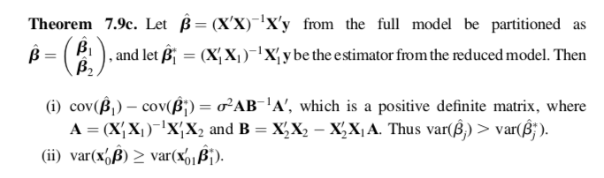

```{r setup, include=FALSE}
knitr::opts_chunk$set(echo = TRUE)

#Frank's regression package
library(rms)

#all hail pipes
library(magrittr)
library(dplyr)

#set the seed so that your simulation results are reproducible
set.seed(333)
```

#Underfitting
#Generate data
Simulate `n = 1000` independent observations from the following distributions:

  1.  $x_{1i} \sim N(0,1)$
  
```{r}
x1 <- rnorm(n = 1000, mean = 0, sd = 1)
```

  2.  $X_{2i} \sim N(x_{1i}, 1)$
  
```{r}
x2 <- rnorm(n = 1000, mean = x1, sd = 1)
```

  3.  $y_i \sim N(2 + 2x_{1i} + 3x_{2i}, 1)$
  
```{r}
y <- rnorm(n = 1000, mean = 2 + 2*x1 + 3*x2, sd = 1)
```

Based on the way we've generate our data, the correct model is $$y_{i} = \beta_0 + \beta_1x_{1i} + \beta_2x_{2i} + \epsilon_i.$$

Begin by fitting the **correct** model,

```{r}
model_full <- ols(y ~ x1 + x2)
```

and then fit the reduced (e.g. underfitted) model for $y_i$ on $x_{1i}$ without adjusting for $x_{2i}$.

```{r}
model_red <- ols(y ~ x1)
```

Why is this model underfitted? 

\begin{quote}
Because from the way we generated the $y_i$, we know that $y_i$ depends on not only $x_{1i}$ but also $x_{2i}$. 
\end{quote}

Compare the coefficients on $x_{1i}$ from the full ($\hat{\beta}_1$)

```{r}
model_full$coefficients["x1"]
```

and reduced ($\hat{\beta}_1^*$) models.

```{r}
model_red$coefficients["x1"]
```

Is $\hat{\beta}_1^*$ biased? 
\begin{quote}
Yes, we see that $\hat{\beta}_1^*$ is inflated over $\hat{\beta}_1$ (from the true model). 
\end{quote}

Compare the standard errors of the coefficients on $x_{1i}$ from the full ($SE(\hat{\beta}_1)$)

```{r}
diag(model_full$var)["x1"] %>% sqrt()
```

and reduced ($SE(\hat{\beta}_1^*)$) models.

```{r}
diag(model_red$var)["x1"] %>% sqrt()
```

Is $SE(\hat{\beta}_1^*)$ biased? 
\begin{quote}
Yes, once again we see that $SE(\hat{\beta}_1^*)$ is inflated over $SE(\hat{\beta}_1)$. Thus, we have that the reduced model has positively biased estimators and standard errors. 
\end{quote}



Using the full and reduced model, show that Theorem 7.9c (i) holds: 

```{r}
#LHS: cov(beta-hat1) - cov(beta-hat1*)
lhs <- diag(model_full$var)["x1"] - diag(model_red$var)["x1"]

#RHS: sigma2A(B-inv)A'
A <- solve(t(x1)%*%x1)%*%t(x1)%*%x2
B <- t(x2)%*%x1-t(x2)%*%x1%*%A
sigma2 <- var(y)
rhs <- sigma2*A%*%solve(B)%*%t(A)

#Check LHS = RHS
lhs == rhs
```

What do we observe? 
\begin{quote}
Theorem 7.9c holds true iff we know the true error variance, $\sigma^2$. In this case we don't! So we can only plug in estimates, which can be biased. Thus, the theorem doesn't hold with estimates (only true values) and we cannot necessarily conclude that the true $Var(\hat{\beta}_1) > Var(\hat{\beta}_1^*)$. 
\end{quote}

Compare the estimated variances.

```{r}
#estimated variance from full model (correct)
model_full$stats["Sigma"]
#estimated variance from reduced model (underfitted)
model_red$stats["Sigma"]
```

Is $\hat{s}^{2*}$ biased? 
\begin{quote}
We see that the estimated variance of the reduced model was greater than that of the full (true) model. This is \textbf{Theorem 7.9d.}.
\end{quote}

Fit the model $$x_{2i} = \gamma_0 + \gamma_1x_{1i} + \delta_{i},$$ where $\delta_{i} \sim N(0,\theta)$. 

```{r}
model_btwn <- ols(x2 ~ x1)
```

We know that $y_i = \beta_0 + \beta_1x_{1i}+ \beta_2x_{2i} + \epsilon_{i}$ (correct model) and $x_{2i} = \gamma_0 + \gamma_1x_{1i} + \delta_i$ (between model). If we begin with the correct model, we have
\begin{eqnarray*}
y_i &=& \beta_0 + \beta_1x_{1i}+ \beta_2x_{2i} + \epsilon_{i} \\
&=& \beta_0 + \beta_1x_{1i}+ \beta_2[\gamma_0 + \gamma_1x_{1i} + \delta_i] + \epsilon_{i} \text{ subbing in the between model}\\
&=& (\beta_0 + \beta_2\gamma_0) + (\beta_1 + \beta_2\gamma_1)x_{1i} + (\beta_2\delta_i + \epsilon_{i})
\end{eqnarray*}
Now if we set this to be equal to the reduced model,
\begin{eqnarray*}
y_i &=& (\beta_0 + \beta_2\gamma_0) + (\beta_1 + \beta_2\gamma_1)x_{1i} + (\beta_2\delta_i + \epsilon_{i}) \\
\beta_0^* + \beta_1^*x_{1i} + \epsilon_i^* &\overset{set}{=}&  (\beta_0 + \beta_2\gamma_0) + (\beta_1 + \beta_2\gamma_1)x_{1i} + (\beta_2\delta_i + \epsilon_{i})
\end{eqnarray*}
Hence, $\beta_1^* = \beta_1 + \beta_2\gamma_1$. Use this relationship to get $\beta_1$ based only on your reduced and between models

```{r}
model_red$coefficients["x1"] - model_full$coefficients["x2"]*model_btwn$coefficients["x1"]
```

and compare it to $\hat{\beta}_1$ from the full model.

```{r}
model_full$coefficients["x1"]
```

##Mediator variables
Suppose $x_1$ represents a measure of how a person was parented as a child, and researchers want to know whether this affects how confident a person feels about parenting their own children ($y_i$). 

It is believed that the way in which a person is parented affects their self confidence and self-esteem later in life ($x_2$), which in turn affects how confident a person feels about parenting their own children ($y_i$), i.e. $x_2$ is a mediator of the relationship between $x_1$ and $y$. 

There are also other indirect effects of $x_1$ on $y$ through other unmeasured mechanisms (e.g. parenting strategies). 

Suppose one fits the above reduced model. Is $\hat{\beta}_1^{*}$ still biased?

\begin{quote}
It’s not biased because we are interested in the effect of $x_1$ on $y$. If we put $x_2$ into the analysis, since $x_2$ is a mediator, it will take away most effect on $y$ from $x_1$.
\end{quote}

#Overfitting
#Generate data
Simulate `n = 1000` independent observations from the following distributions:

  1.  $x_{1i} \sim N(0,1)$
  
```{r}
x1 <- rnorm(n = 1000, mean = 0, sd = 1)
```

  2.  $X_{2i} \sim N(x_{1i}, 1)$
  
```{r}
x2 <- rnorm(n = 1000, mean = x1, sd = 1)
```

  3.  $y_i \sim N(2 + 2x_{1i} + 3x_{2i}, 1)$
  
```{r}
y <- rnorm(n = 1000, mean = 2 + 2*x1, sd = 1)
```

Based on the way we've generate our data, the correct model is $$y_{i} = \beta_0 + \beta_1x_{1i} + \beta_2x_{2i} + \epsilon_i.$$

Begin by fitting the full (e.g. overfitted) model,

```{r}
model_full <- ols(y ~ x1 + x2)
```

and then fit the reduced (**correct**) model for $y_i$ on $x_{1i}$ without adjusting for $x_{2i}$.

```{r}
model_red <- ols(y ~ x1)
```

Why is this model overfitted? 

\begin{quote}
Because from the way we generated the $y_i$, we know that $y_i$ depends only on $x_{1i}$ but we controlled for $x_{2i}$ anyway. 
\end{quote}

Compare the coefficients on $x_{1i}$ from the full ($\hat{\beta}_1$)

```{r}
model_full$coefficients["x1"]
```

and reduced ($\hat{\beta}_1^*$) models.

```{r}
model_red$coefficients["x1"]
```

Is $\hat{\beta}_1^*$ biased? 
\begin{quote}
No, $\hat{\beta}_1^* \approx \hat{\beta}_1$ because $\beta_2$ is almost 0 (since $y_i$ doesn't depend on $x_2$ by design). 
\end{quote}

Compare the standard errors of the coefficients on $x_{1i}$ from the full ($SE(\hat{\beta}_1)$)

```{r}
diag(model_full$var)["x1"] %>% sqrt()
```

and reduced ($SE(\hat{\beta}_1^*)$) models.

```{r}
diag(model_red$var)["x1"] %>% sqrt()
```

Is $SE(\hat{\beta}_1^*)$ biased? 
\begin{quote}
Yes, we see that $SE(\hat{\beta}_1^*)$ from the correct model is smaller than $SE(\hat{\beta}_1)$ from the overfitted model. Thus, we have that overfitted model has unbiased estimates but inflated standard errors.
\end{quote}

Compare the estimated variances.

```{r}
#estimated variance from full model (correct)
model_full$stats["Sigma"]
#estimated variance from reduced model (underfitted)
model_red$stats["Sigma"]
```

Is $\hat{s}^{2*}$ biased? 

\begin{quote}
No, the estimated variance from the overfitted model is not biased.
\end{quote}

#Independent covariates
Repeat the overfit and underfit exercises (above) by simulating $x_{2i} \sim N(0,1)$ instead (e.g. $x_{2i}$ is not correlated with $x_{1i}$) and see how the results differ.

##Underfitting

```{r}
#generate new data
x1 <- rnorm(n = 1000, mean = 0, sd = 1)
x2 <- rnorm(n = 1000, mean = x1, sd = 1)
y <- rnorm(n = 1000, mean = 2 + 2*x1 + 3*x2, sd = 1)

#fit full model y ~ x1 + x2
model_full <- ols(y ~ x1 + x2)
#fit reduced model y ~ x1
model_red <- ols(y ~ x1)

#compare coefficients on x1
model_full$coefficients["x1"]
model_red$coefficients["x1"]

#compare SEs on coefficients on x1
diag(model_full$var)["x1"] %>% sqrt()
diag(model_red$var)["x1"] %>% sqrt()

#compare estimated variances
model_full$stats["Sigma"]
model_red$stats["Sigma"]
```

Observations on overfitting when $x_1 \perp x_2$:

  1.  Coefficient from reduced model $>$ coefficient from full (correct) model
  2.  Standard error from reduced model > standard error from full (correct) model
  3.  Variance greater for reduced than full model

##Overfitting

```{r}
#generate new data
x1 <- rnorm(n = 1000, mean = 0, sd = 1)
x2 <- rnorm(n = 1000, mean = 0, sd = 1)
y <- rnorm(n = 1000, mean = 2 + 2*x1, sd = 1)

#fit full model y ~ x1 + x2
model_full <- ols(y ~ x1 + x2)
#fit reduced model y ~ x1
model_red <- ols(y ~ x1)

#compare coefficients on x1
model_full$coefficients["x1"]
model_red$coefficients["x1"]

#compare SEs on coefficients on x1
diag(model_full$var)["x1"] %>% sqrt()
diag(model_red$var)["x1"] %>% sqrt()

#compare estimated variances
model_full$stats["Sigma"]
model_red$stats["Sigma"]
```

Observations on overfitting when $x_1 \perp x_2$:

  1.  Coefficient from reduced model = coefficient from full (correct) model
  2.  Standard error from reduced model = standard error from full (correct) model
  3.  Same Variance for reduced and full models